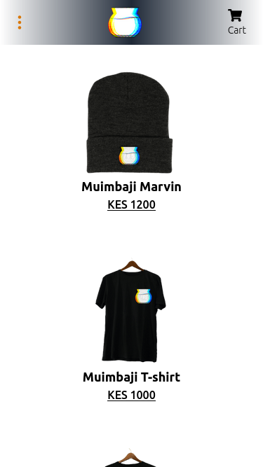
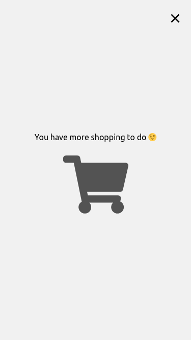
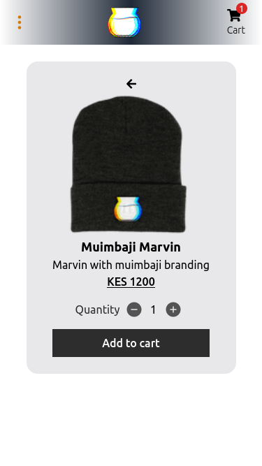
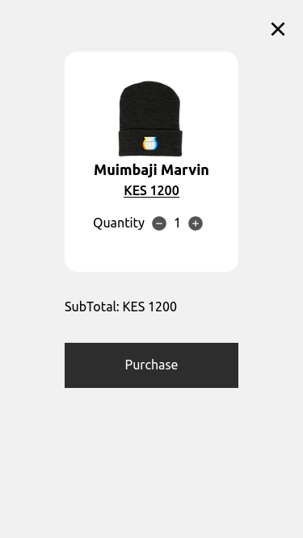
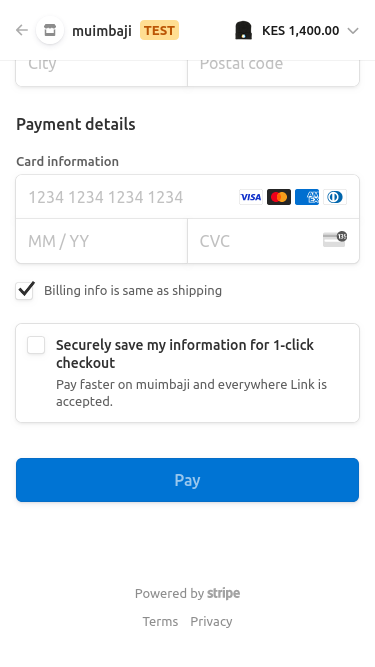
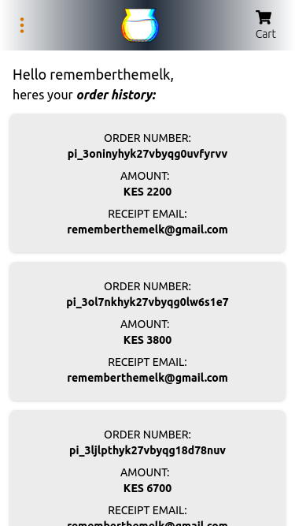

# Frontend

This project uses Graphql to fetch product information from the backend, while Next.js's built-in REST API is used to connect to OAuth for account information and Stripe for transactions.

    
    
    
    
    
    

## Installation

First, navigate to the _frontend_ directory: `cd frontend`,

Install project dependencies: `npm install`,

## Usage

Run the development server using the command: `npm run dev`

Open [http://localhost:3000](http://localhost:3000) with your browser to see the result.

You can start editing the page by modifying `pages/index.js`. The page auto-updates as you edit the file.

[API routes](https://nextjs.org/docs/api-routes/introduction) can be accessed on [http://localhost:3000/api/hello](http://localhost:3000/api/hello). This endpoint can be edited in `pages/api/hello.js`.

The `pages/api` directory is mapped to `/api/*`. Files in this directory are treated as [API routes](https://nextjs.org/docs/api-routes/introduction) instead of React pages.

## Related Projects

- [store-backend](../store-backend/): Contains server side logic and headless cms handling the admin panel

## Author

- **Karanja J Njuguna** - <[kei-en](https://github.com/kei-en)>
